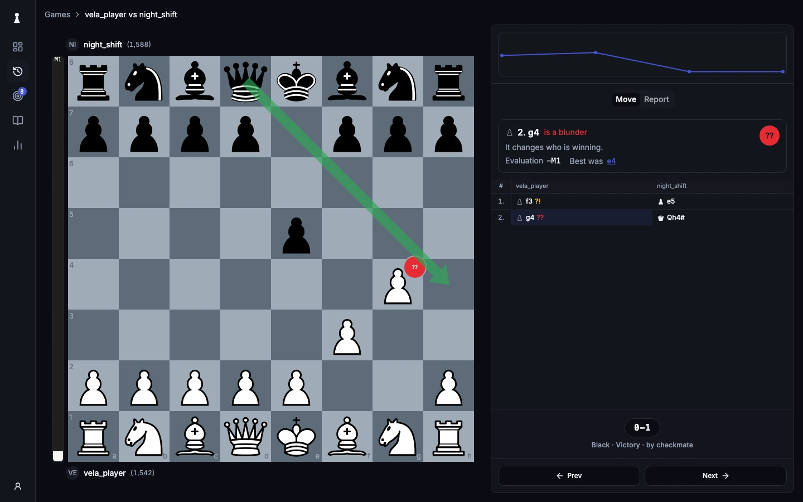

<p align="center">
  <picture>
    <source media="(prefers-color-scheme: dark)" srcset="libs/ui/src/brand/logo/velachess-horizontal-dark-bg.svg">
    
  </picture>
</p>

<h1 align="center">Turn your games into training</h1>

<p align="center">
  Import your games. Find what went wrong. 
  Train the positions that matter.
</p>

<p align="center">
  <a href="https://app.velachess.com">Try VelaChess</a> ·
  <a href="docs/how-to/self-host.md">Self-host</a> ·
  <a href="docs/README.md">Documentation</a>
</p>

<p align="center">
  
</p>

VelaChess turns your own chess games into practice.

It builds a repertoire from the moves you play, finds where you leave your lines, checks those mistakes with Stockfish, and turns the important ones into spaced-repetition exercises.

Use the hosted public beta or run the full application yourself.

## How it works

```text
Chess.com / Lichess games
          ↓
        Sync
          ↓
Repertoire from your own play
          ↓
        Judge
          ↓
Deviations from your lines
          ↓
      Stockfish
          ↓
Harmful mistakes become exercises
          ↓
         FSRS
          ↓
        Review
```

- **Sync** — import games from Chess.com and Lichess
- **Extract** — build a repertoire from the openings you actually play
- **Judge** — compare your games against your repertoire
- **Analyze** — review moves with Stockfish
- **Drill** — practise important mistakes with spaced repetition

## Quick start

Requirements:

- Node.js 22+
- pnpm via Corepack
- Docker

```bash
cp .env.example .env

pnpm dev:setup
pnpm dev
```

This starts:

- site → `http://localhost:3001`
- web → `http://localhost:5173`
- API → `http://localhost:3000`
- worker

On a fresh database, VelaChess creates the user configured through `VELACHESS_BOOTSTRAP_USER_*`. Sign-up is disabled by default.

To run the full stack with Docker:

```bash
docker compose -f docker/docker-compose.yml up --build
```

See [Running locally](docs/how-to/run-locally.md) for development setup or [Self-hosting](docs/how-to/self-host.md) for deployment.

## Using VelaChess

Connect your Chess.com or Lichess account and let VelaChess import your games.

From there you can:

1. Review your games
2. Explore the repertoire extracted from your play
3. Find deviations from your usual lines
4. Analyze important positions with Stockfish
5. Review due exercises

Game analysis runs on demand when you open a game.

## API

The web app runs on top of the VelaChess HTTP API.

Public endpoints:

```bash
curl localhost:3000/health
curl localhost:3000/openapi.json
```

Accounts, games, repertoires, analysis, and drills require authentication.

## Architecture

VelaChess is a pnpm monorepo.

```text
apps/
  server        Hono API
  worker        background jobs
  web           TanStack Start application
  site          Next.js website

libs/
  application   application workflows
  chess         chess rules and PGN
  analysis      move classification
  repertoire    repertoire extraction and judgment
  scheduler     FSRS scheduling
  ui            shared design system

libs/infra/
  db            Postgres + Drizzle
  queue         pg-boss
  engine        Stockfish
  platforms     Chess.com + Lichess
```

Application logic lives in libs/application, with apps/server and apps/worker kept as thin runtime shells.

Read the [architecture documentation](docs/explanation/architecture.md) for the full model.

## Development

```bash
pnpm test
pnpm check
pnpm fmt:check
pnpm site:quality
```

- `pnpm test` — workspace tests
- `pnpm check` — typecheck, lint, and Knip
- `pnpm fmt:check` — formatting
- `pnpm site:quality` — site build, SEO checks, and Lighthouse CI

Tests use PGlite and Stockfish locally.

See [Verifying a change](docs/how-to/verify-a-change.md) for the full verification flow.

## Contributing

Contributions are welcome.

For small fixes and documentation improvements, open a pull request directly.

For larger features or architecture changes, open an issue first.

1. Fork the repository
2. Create a branch
3. Make your changes and add tests
4. Run `pnpm test` and `pnpm check`
5. Open a pull request

See [CONTRIBUTING.md](CONTRIBUTING.md) for setup, conventions, and contribution guidelines.

## Contributors

Thanks to everyone helping make VelaChess better ❤️

<a href="https://github.com/velachess/velachess/graphs/contributors">
  
</a>

## Security

Found a vulnerability?

Please do not open a public issue. See [SECURITY.md](SECURITY.md) for private reporting instructions.

## License

VelaChess is licensed under [GPL-3.0-or-later](LICENSE).

It uses GPL software including [chessops](https://github.com/niklasf/chessops) and [Stockfish](https://stockfishchess.org/).

See [NOTICE](NOTICE) for third-party attributions.
