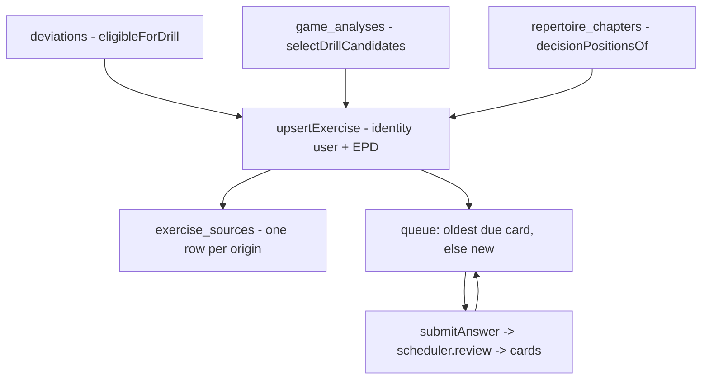

# libs/application/drills

**[DRILL] — turns mistakes, deviations and prepared lines into recallable
exercises.** Three slices own the loop: `seed-exercises` (triage and
generation), `get-next-drill` (the queue), `submit-answer` (grading and the
FSRS handoff). Deciding *when* to review is the scheduler's job, not this
package's. Exact rules, constants and shapes live in
`docs/reference/drills.md`; this document is the reasoning.

## Flow



## Three origins, three questions

An exercise can be born three ways, and the origins deliberately ask
different questions:

- **`repertoire-deviation`** — did you play what you *decided*? Your own move
  left your book and the book had an answer to recall. Nothing about
  severity: forgetting your line for a perfectly sound alternative costs zero
  evaluation, so the engine is permanently silent about it — and that is
  exactly the failure repertoire drilling exists to catch. It used to require
  the engine to confirm harm; that made this origin a near-subset of the
  engine origin and trapped deviations from games analysed before their
  repertoire existed, so the requirement was removed. Volume needs no budget
  here: `deviations_game_repertoire` guarantees at most one deviation per
  game per repertoire.
- **`engine-blunder`** — did you play *well*? Every graded ply of your side is
  a candidate. Volume does not come from a severity floor — measured on real
  games, blunder is the most common category, so a fixed floor either starves
  strong players or drowns beginners. Instead candidates are ranked by
  `winChanceLoss` and cut at a per-game budget (5), which calibrates itself:
  someone who blunders gets blunders, someone who only plays inaccuracies
  gets inaccuracies. `minSeverity` (`inaccuracy`) survives only as an
  absolute "never drill a fine move" floor, shared with nothing else via
  `severeEnough`.
- **`repertoire-line`** — the preparation itself, position by position. Every
  decision position of a chapter is seeded when the chapter lands, so a book
  is trainable the moment it exists instead of waiting for its owner to fail
  in a game. A chapter is tens of positions entering as `new` cards; the
  scoped queue (`?repertoire=`/`?chapter=`) exists so mistake drills stay
  reachable while a fresh extraction's line drills fill the new pile — the
  two shipped together on purpose.

## Exercise identity and provenance

An exercise is `(user, position_key)` — EPD, the same key the repertoire
package indexes by. The same position reached in two games, or via two
origins, merges into one exercise with one provenance row per origin in
`exercise_sources`, enforced by partial unique indexes rather than caller
discipline.

When origins collide, the preparation wins the *answer*: a repertoire seed
refreshes `expected_sans`, an engine seed only adds its provenance. The
engine is a strong opinion about the position; your book is a decision about
what you intend to play, and drilling should not quietly redirect you away
from it. The engine origin still earns the exercise its place in the queue —
it just does not get to rewrite the answer. The same precedence explains the
drill screen's sentence: `drillContextOf` prefers deviation, then line, then
engine provenance.

The engine origin is a natural key `(game_id, ply)` rather than a foreign
key, because graded plies live as jsonb on `game_analyses`, not as rows.

## Triage is plumbing

Nobody presses "triage" — `triageAndSeed` hangs off the two events that
produce something to triage: analysis completion and judging. Both orderings
matter: a game can be analysed before its repertoire exists (the judge then
fills severity from the cached report and seeds), or judged before analysis
(completion seeds). Triage is idempotent by construction — candidates are
rows with no exercise source yet, and the upsert conflicts the rest away —
so re-running is always safe. On the deviation path, failing a prepared
position that is already scheduled is the strongest evidence its interval
was too long, so its review is pulled to now (`pullCardDueNow` — never
later).

## Answering and grading

`checkAnswer` is strict SAN membership — any prepared answer counts as
correct. The caller converts UI input to SAN with the chess package's
`makeSan`; this module never parses moves. `gradeResponse` maps binary
correctness to the four-value grade scale: `good` on correct, `again` on
wrong. `hard`/`easy` are reserved for signals not collected yet —
`response_time_ms` already persists so a future mapping has data to learn
from, but it deliberately does not affect the grade today. The db enum
carries all four values from day one; extending the mapping later is a code
change, not a migration.

## The queue

Oldest due card first (`due <= now`, ordered by due date), else a
never-scheduled exercise, else nothing. That is the whole policy: there is
no interleaving of new and due, no daily new-card limit, no randomization,
and no retirement — the knobs FSRS products usually expose do not exist yet,
and the new-pile pick order is undefined (no `ORDER BY`). Scope narrows both
piles to an origin, repertoire or chapter, which is what lets a chapter's
Train button and an insight's CTA land on the drills they are actually
about.

## Testing

The eligibility and selection rules run as pure unit tests (type gate,
prepared-answer gate, harmless-deviation and unanalysed-deviation cases,
ranking, budget, tie-break determinism). The e2e in
`libs/infra/db/__tests__/drill-flow.test.ts` chains the real pipeline —
judgment → engine signal → triage → deduped exercise with provenance →
right and wrong answers → graded responses read back. Queue counting,
context precedence and scheduling have their own suites
(`drill-queue.test.ts`, `drill-context.test.ts`, `scheduler-flow.test.ts`);
the application-level acceptance covers scoped queues, `pullCardDueNow` and
decision-position seeding on chapter add.

## Layout

```
seed-exercises/
  eligibility.ts    eligibleForDrill (deviation path), severeEnough (shared floor)
  selection.ts      selectDrillCandidates — rank by loss, cut at budget
  exercise.ts       seedFromDeviation, seedFromGradedPly (UCI→SAN), seedFromDecisionPosition
  seed-exercises.ts triageAndSeed, seedsFor — orchestration, both mistake origins
  seed-lines.ts     seedRepertoireLines — the repertoire-line origin
  queries.ts        listTriageCandidates
get-next-drill/
  get-next-drill.ts getReviewItem — due first, else new
  queries.ts        getNewExercise
submit-answer/
  answer.ts         checkAnswer, gradeResponse
  submit-answer.ts  submitAnswer — response row + FSRS review
```
